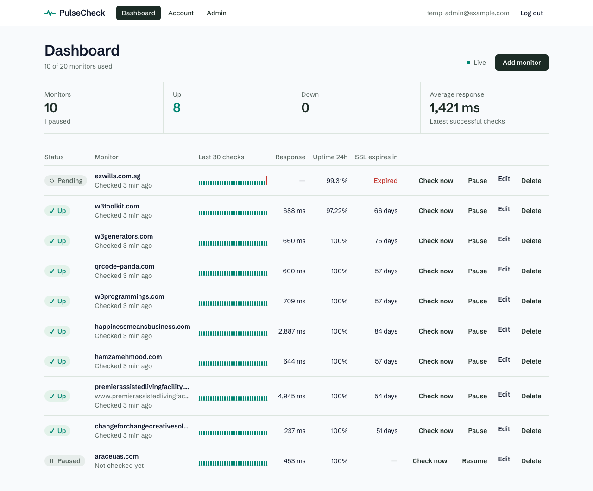

# PulseCheck

PulseCheck is a multi-user uptime monitor. People sign up, add the websites they care about,
and get a live dashboard showing whether each site is up, how fast it responds, how many days
its SSL certificate has left, and email alerts when it goes down or recovers. It is a Node.js
(Express + PostgreSQL) API with a React front end, built to run locally and to exercise the
core Node.js backend concepts in real code.



## Features

**For users**

- Sign up, log in, forgot/reset password by email, change password, delete account
- Add up to 20 monitors (HTTP/HTTPS URLs), each checked every 5+ minutes
- Dashboard with live status updates (Server-Sent Events)
- Per-monitor detail: response-time chart, uptime for 24h / 7d / 30d, incidents, check history
- Down/recovery and SSL-expiry email alerts (on/off in account settings)
- CSV export of a monitor's check history

**For admins**

- System stats: users, monitors up/down, checks in the last 24h, last check-run summary
- Users list with search and pagination; disable or re-enable accounts

## Tech stack

- **Backend:** Node.js 22+, Express 5, PostgreSQL + Prisma, Zod, Pino, JWT + rotating
  refresh tokens, bcrypt, helmet, express-rate-limit, Nodemailer
- **Frontend:** Vite, React, TypeScript, React Router, TanStack Query, Tailwind CSS, Recharts
- **Tooling:** npm workspaces, TypeScript strict, ESLint + Prettier, Vitest, Supertest,
  React Testing Library, Docker Compose (Postgres ×2 + Mailpit), GitHub Actions CI

## Quick start

```bash
nvm use
npm install
cp backend/.env.example backend/.env
docker compose up -d
npm run db:migrate
npm run admin:create      # prompts for admin email and password
npm run db:seed           # adds 10 sample sites to the admin account
npm run dev               # frontend http://localhost:5173, API http://localhost:4000
```

Full instructions and troubleshooting: [docs/installation.md](docs/installation.md).

## Scripts

Run from the repository root.

| Script                    | What it does                                                  |
| ------------------------- | ------------------------------------------------------------- |
| `npm run dev`             | Start the API (tsx watch) and the web app (Vite) together     |
| `npm test`                | Backend tests, then frontend tests                            |
| `npm run test:backend`    | Backend tests only (uses the test database)                   |
| `npm run test:frontend`   | Frontend tests only                                           |
| `npm run lint`            | ESLint across both workspaces                                 |
| `npm run format`          | Prettier write (`format:check` to verify only)                |
| `npm run typecheck`       | `tsc --noEmit` for both workspaces                            |
| `npm run build`           | Compile the API and build the web app                         |
| `npm run db:migrate`      | Apply/create Prisma migrations on the dev database            |
| `npm run db:migrate:test` | Apply migrations to the test database                         |
| `npm run db:generate`     | Regenerate the Prisma client                                  |
| `npm run db:seed`         | Attach the 10 sample monitors to the first admin (idempotent) |
| `npm run db:studio`       | Open Prisma Studio                                            |
| `npm run admin:create`    | Interactive CLI to create or promote an admin                 |

## Documentation

- [Installation](docs/installation.md): running locally, Mailpit, tests, troubleshooting
- [Architecture](docs/architecture.md): diagrams, request lifecycle, data model
- [API](docs/api.md): every endpoint with examples
- [Node.js concepts](docs/node-concepts.md): where each concept lives, plus interview Q&A
- [Decisions](docs/decisions.md): design decisions and the alternatives considered
- [Deployment](docs/deployment.md): how this _could_ be deployed (documentation only)
