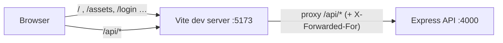

# Architecture

> Milestone 8 status: this document covers the frontend ↔ API setup and the auth flow. The
> full component, check-run, forgot-password and state diagrams, the middleware chain and
> the data model are added in the docs pass (milestone 11).

## Frontend and the Vite dev proxy

In development the browser only ever talks to one origin, `http://localhost:5173`, which is
Vite. Vite serves the React app and forwards every request starting with `/api` to the
Express API on `http://localhost:4000` (`frontend/vite.config.ts` → `server.proxy`).



Why it matters:

- **Same origin means no CORS.** The React app calls `fetch('/api/monitors')`, a relative
  URL. The API needs no CORS middleware and the browser sends no preflight `OPTIONS`
  requests.
- **Cookies just work.** The `pc_refresh` cookie is set by a response that came from
  `localhost:5173`, so the browser stores it for that origin and sends it back on
  `/api/auth/*` calls. With two origins we would need `credentials: 'include'`,
  `Access-Control-Allow-Credentials`, and `SameSite=None; Secure` cookies.
- **Real client IPs.** The proxy adds `X-Forwarded-For`, and Express trusts it only from
  loopback (`app.set('trust proxy', 'loopback')`), so rate limits see the real client.
- **SSE streams pass through unbuffered.** The proxy config leaves `text/event-stream`
  responses alone (`Cache-Control: no-transform`).

In production the same property comes from serving the built React app from Express itself
(see [deployment.md](./deployment.md)).

## Frontend auth flow

| Piece        | File                                 | Role                                                                                                                                                                                                                                         |
| ------------ | ------------------------------------ | -------------------------------------------------------------------------------------------------------------------------------------------------------------------------------------------------------------------------------------------- |
| API client   | `frontend/src/api/client.ts`         | Keeps the access token in a module variable (memory only), adds `Authorization: Bearer`, refreshes once on 401 and retries, and shares one in-flight refresh between concurrent callers                                                      |
| Auth context | `frontend/src/auth/AuthProvider.tsx` | `status` (`loading`/`authenticated`/`guest`), `user`, `login`, `signup`, `logout`. On load it calls `/api/auth/refresh` to restore the session from the cookie. If a refresh fails mid-session it becomes a guest and clears the query cache |
| Route guards | `frontend/src/auth/guards.tsx`       | `ProtectedRoute` sends guests to `/login` and remembers where they were going. `GuestRoute` sends logged-in users onward (back to that page, or `/dashboard`). `AdminRoute` shows "Admins only" to non-admins                                |

The guards are for user experience only. Every rule is enforced again by the API.

### Refresh-token rotation

```mermaid
sequenceDiagram
  autonumber
  participant B as Browser (React)
  participant A as API /api/auth/refresh
  participant D as PostgreSQL

  Note over B: Page load or access token expired (401)
  B->>A: POST /refresh (cookie pc_refresh = token T1)
  A->>A: verify JWT signature/expiry, read jti + family
  A->>D: find refresh_tokens row by jti
  A->>A: timingSafeEqual(sha256(T1), row.token_hash)
  alt row already revoked
    A->>D: revoke every live token in the family
    A-->>B: 401 REFRESH_TOKEN_REUSED (if the family had a live token) or INVALID_REFRESH_TOKEN
  else valid
    A->>D: BEGIN; UPDATE … SET revoked_at = now() WHERE id = jti AND revoked_at IS NULL
    A->>D: INSERT new token T2 (same family, hash only); COMMIT
    A-->>B: 200 { accessToken, user } + Set-Cookie pc_refresh = T2
  end
  Note over B: Access token kept in memory only; T2 lives in the httpOnly cookie
```
