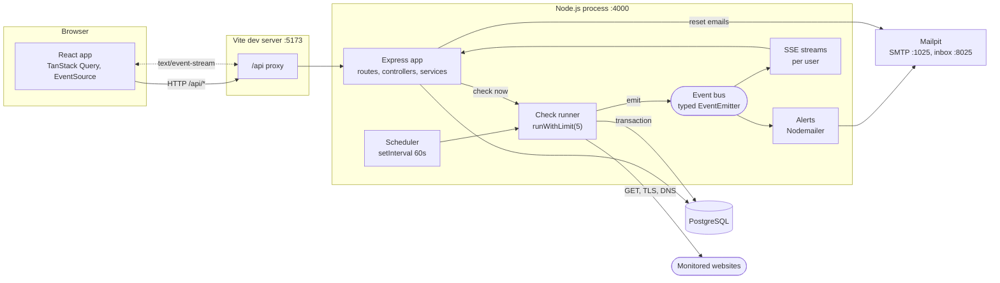
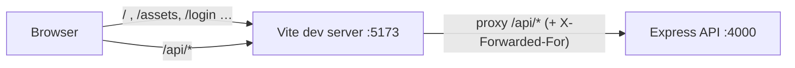
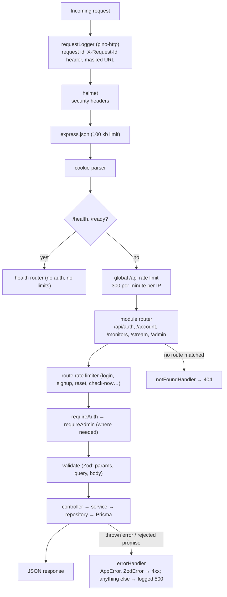
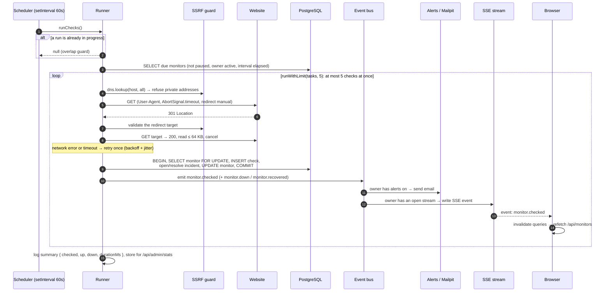
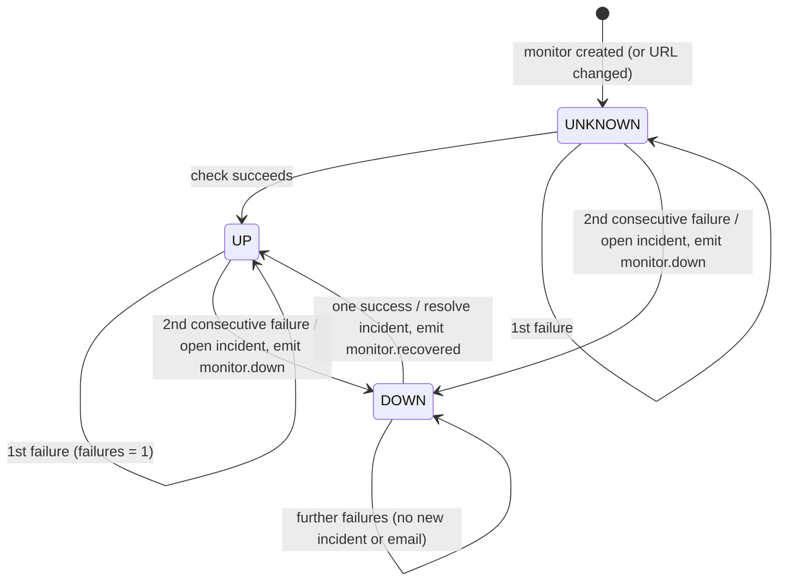
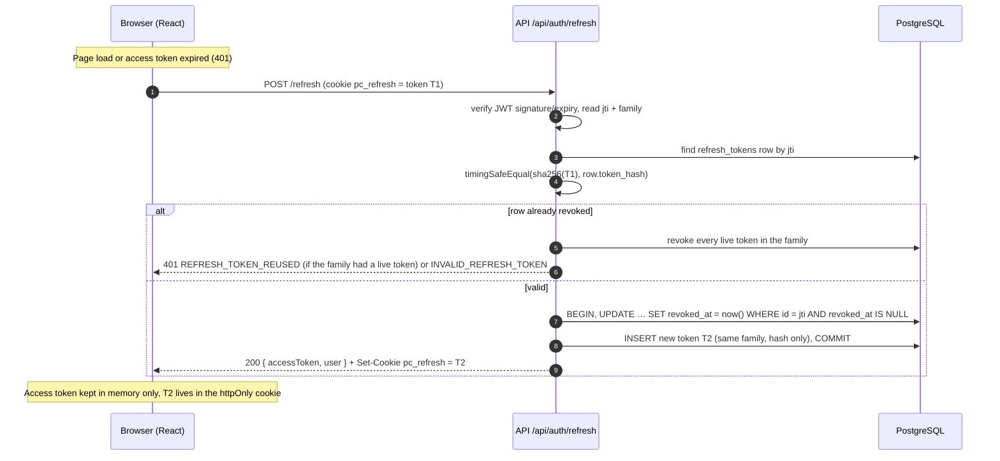
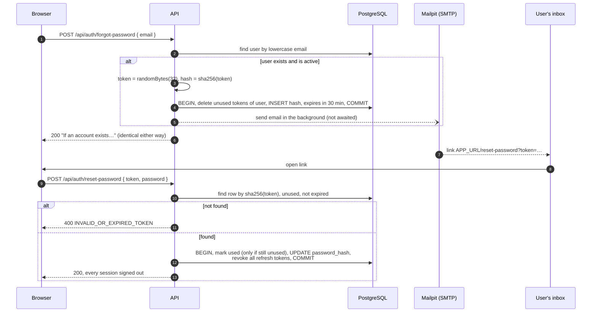
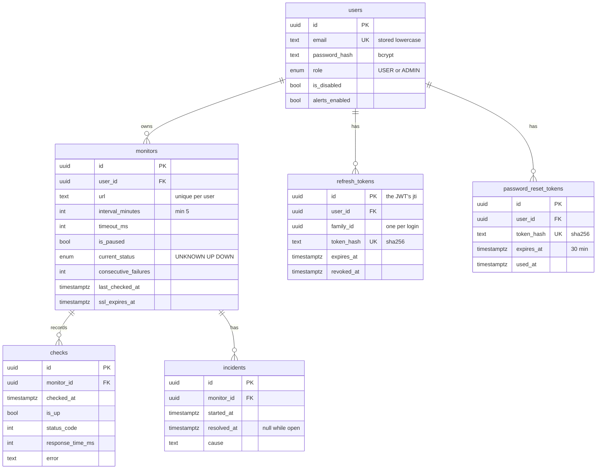

# Architecture

How PulseCheck is put together: the moving parts, how a request and a check run flow through
them, and how the data is modelled. For why each choice was made, see
[decisions.md](./decisions.md). For the Node.js concepts behind the code, see
[node-concepts.md](./node-concepts.md).

## Components



Everything server-side runs in **one Node.js process**: the HTTP API, the scheduler, the
check runner, the event bus, and the SSE connections. That keeps local setup to a single
`npm run dev`. The places where this would have to change for several instances are listed
in [node-concepts.md §20](./node-concepts.md) and [decisions.md](./decisions.md).

## Frontend and the Vite dev proxy

In development the browser only ever talks to one origin, `http://localhost:5173`, which is
Vite. Vite serves the React app and forwards every request starting with `/api` to the
Express API on `http://localhost:4000` (`frontend/vite.config.ts` → `server.proxy`).



Why it matters:

- **Same origin means no CORS.** The React app calls `fetch('/api/monitors')`, a relative
  URL. The API needs no CORS middleware and the browser sends no preflight `OPTIONS`
  requests.
- **Cookies just work.** The `pc_refresh` cookie is set by a response that came from
  `localhost:5173`, so the browser stores it for that origin and sends it back on
  `/api/auth/*` calls. With two origins we would need `credentials: 'include'`,
  `Access-Control-Allow-Credentials`, and `SameSite=None; Secure` cookies.
- **Real client IPs.** The proxy adds `X-Forwarded-For`, and Express trusts it only from
  loopback (`app.set('trust proxy', 'loopback')`), so rate limits see the real client.
- **SSE streams pass through unbuffered.** The proxy config leaves `text/event-stream`
  responses alone (`Cache-Control: no-transform`).

In production the same property comes from serving the built React app from Express itself
(see [deployment.md](./deployment.md)).

## Request lifecycle and middleware chain

`backend/src/app.ts` registers middleware in this order. Every request passes through the
global layers top to bottom; route-level middleware runs only for matching routes.



- **`requireAuth`** verifies the Bearer JWT, then loads the user by primary key. A disabled
  user gets `403` immediately, and `req.user` comes from the database row.
- **`requireAdmin`** checks `req.user.role`, which came from the database, not from the
  token.
- **`validate`** replaces `req.body`, `req.query` and `req.params` with Zod's parsed,
  coerced and normalised output. Controllers declare those types through Express's
  `RequestHandler` generics.
- **Errors:** Express 5 forwards rejected promises from async handlers to `errorHandler`.
  It is the only place that turns errors into responses, always in the
  `{ error: { code, message, details? } }` shape.

## Folder structure and the layered module pattern

```
backend/src/
├── server.ts           process lifecycle: listen, scheduler, signals, graceful shutdown
├── app.ts              builds the Express app (no listen), used by server.ts and by tests
├── config/env.ts       Zod-validated environment, loaded once
├── lib/                cross-cutting tools with no HTTP knowledge
│   ├── logger, errors, prisma, mailer, tokens, password, rateLimit
│   ├── concurrency (runWithLimit), retry, events (typed bus), csv, ssrf-guard
├── middleware/         requestId/logging, requireAuth, requireAdmin, validate, errorHandler
├── modules/<feature>/  one folder per feature
│   ├── *.routes.ts       URL → middleware chain → controller
│   ├── *.controller.ts   HTTP only: read req, call the service, write res
│   ├── *.service.ts      business rules; never touches req/res
│   ├── *.repository.ts   Prisma queries (always scoped by userId where relevant)
│   └── *.schemas.ts      Zod request schemas and their inferred types
└── generated/prisma/   Prisma client (generated, git-ignored)
```

Modules: `auth`, `account`, `monitors`, `checks` (checker, ssl, runner, scheduler, state
machine, retention), `incidents`, `alerts`, `stream`, `admin`, `health`.

The layers point one way: routes → controller → service → repository. Services can be called
from places other than HTTP, for example `checkMonitorById` is used by both the scheduler and
the check-now endpoint. Modules that need to react to each other communicate through the
event bus, so neither imports the other: the runner emits `monitor.down` and alerts listens;
admin emits `user.disabled` and the stream module listens.

## One check run, from scheduler tick to dashboard update



Daily, per HTTPS monitor, the runner also opens a TLS connection to the vetted IP to read the
certificate's expiry, and emits `monitor.sslExpiring` when fewer than 14 days remain.

## Monitor state machine

`nextState()` in `backend/src/modules/checks/state-machine.ts`:



Paused monitors and monitors of disabled owners are simply not selected as due, so their
state stays frozen until they are resumed or re-enabled.

## Auth

### Frontend pieces

| Piece        | File                                 | Role                                                                                                                                                                                                                                         |
| ------------ | ------------------------------------ | -------------------------------------------------------------------------------------------------------------------------------------------------------------------------------------------------------------------------------------------- |
| API client   | `frontend/src/api/client.ts`         | Keeps the access token in a module variable (memory only), adds `Authorization: Bearer`, refreshes once on 401 and retries, and shares one in-flight refresh between concurrent callers                                                      |
| Auth context | `frontend/src/auth/AuthProvider.tsx` | `status` (`loading`/`authenticated`/`guest`), `user`, `login`, `signup`, `logout`. On load it calls `/api/auth/refresh` to restore the session from the cookie. If a refresh fails mid-session it becomes a guest and clears the query cache |
| Route guards | `frontend/src/auth/guards.tsx`       | `ProtectedRoute` sends guests to `/login` and remembers where they were going. `GuestRoute` sends logged-in users onward (back to that page, or `/dashboard`). `AdminRoute` shows "Admins only" to non-admins                                |

The guards are for user experience only. Every rule is enforced again by the API.

### Refresh-token rotation



### Forgot / reset password



## Frontend data flow and live updates

- **Server state lives in TanStack Query** (`frontend/src/api/*.ts`). Query keys are grouped
  under `['monitors', …]`. Every monitor mutation (create, update, pause, check now, delete)
  invalidates that group, so all screens refetch consistent data. Lists with pagination
  (check history, admin users) use `useInfiniteQuery` with the API's opaque `nextCursor`.
- **Live updates** (`frontend/src/hooks/useStatusStream.ts`):
  1. `POST /api/stream/ticket` with the access token.
  2. `new EventSource('/api/stream?ticket=…')`.
  3. On `monitor.checked`, refetch the monitor list (and that monitor's detail), batched over
     500 ms because a run delivers up to 5 results at once.
  4. On `monitor.down` / `monitor.recovered`, show a polite live-region notice.
  5. On error, close the stream and reconnect with a **new** ticket, using exponential backoff
     with jitter (tickets are single-use, so `EventSource`'s own reconnect can't work).
     After reconnecting, refetch once to catch up on anything missed.
- **The dashboard is the triage view:** down monitors sort first. Each row has a 30-check
  status strip, where failures are taller red ticks so they don't rely on colour alone.
  Status badges pair a word with a glyph.
- **CSV download:** a plain link can't send the `Authorization` header, so the client fetches
  `export.csv` and saves the blob with a temporary object URL.
- **Code splitting:** the monitor detail page, the only one using Recharts, is lazy-loaded
  through React Router's `lazy` route option.

## Data model



Every foreign key is `ON DELETE CASCADE`. Deleting a user removes their monitors, checks,
incidents and tokens in one statement.

### Index choices

| Index                                                          | Serves                                                                                                                                                 |
| -------------------------------------------------------------- | ------------------------------------------------------------------------------------------------------------------------------------------------------ |
| `checks (monitor_id, checked_at DESC)`                         | Latest check per monitor (`LATERAL … LIMIT 1`), the 30-check status strip, keyset pagination of history, 24h/7d/30d uptime windows, CSV export batches |
| `checks (checked_at)`                                          | Retention deletes (`checked_at < cutoff`) and the admin "checks in last 24h" count                                                                     |
| `monitors (user_id, url)` unique                               | Duplicate prevention per user, and "my monitors" lookups (leading column `user_id`)                                                                    |
| `monitors (is_paused, last_checked_at)`                        | The runner's due-monitor query                                                                                                                         |
| `incidents (monitor_id, started_at DESC)`                      | Incidents list per monitor, finding the open incident                                                                                                  |
| `refresh_tokens (family_id)`, `(user_id)`, `token_hash` unique | Revoking a family on reuse, revoking all of a user's sessions, lookup by hash                                                                          |
| `users (email)` unique, `(created_at)`                         | Login lookup; admin users list ordered newest first                                                                                                    |

Uptime percentages are computed in SQL with `COUNT(*) FILTER (WHERE …)`, so check rows are
never loaded into Node to be counted. Checks older than 30 days are deleted daily in batches
of 5,000 (`backend/src/modules/checks/retention.ts`).

### Multi-tenancy: every query scoped to `userId`

Users share tables; isolation is enforced in the repository layer:

- Every monitor query takes both the monitor id and the caller's `userId`
  (`findFirst({ where: { id, userId } })`, `updateMany` / `deleteMany` with both). Someone
  else's monitor is indistinguishable from a missing one, so both return `404`. A test hits
  every `/api/monitors/:id…` endpoint as another user and expects `404` each time.
- Checks and incidents are only reachable through their monitor, after the ownership check.
- SSE streams filter events by `userId`, and the payload sent to the browser has the owner
  id stripped.
- Alert emails go only to the monitor's owner, re-read from the database at send time, and
  only if `alerts_enabled` is on and the owner isn't disabled.
- Admin endpoints are the only cross-tenant views. They return counts and account metadata,
  never password hashes or tokens.
