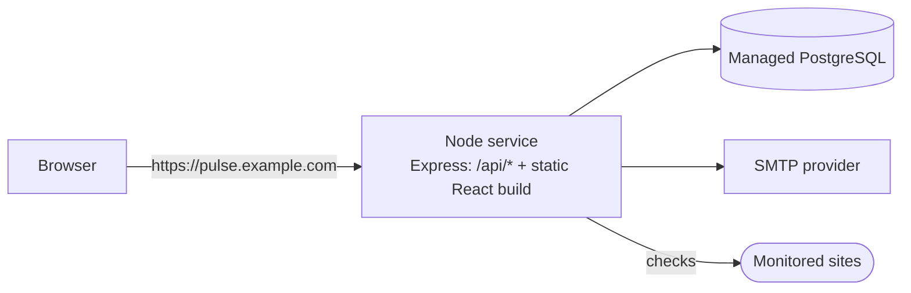

# Deployment (documentation only)

> **PulseCheck is set up to run locally.** This repository contains no deployment
> configuration: no Dockerfile for the app, no `render.yaml`, no deploy workflow. This guide
> explains how it _could_ be deployed and what would have to change. Treat it as a design
> exercise and interview material, not a tested runbook. Hosting providers change their free
> tiers and limits often, so check their current docs before relying on any detail below.

## The simplest production shape: one Node service plus managed PostgreSQL



In development, Vite serves the React app and proxies `/api` to Express so everything shares
one origin. In production, Express can play both roles: serve `frontend/dist` as static files
and answer `/api/*` itself. This is the right first shape because:

- **No CORS.** The SPA calls relative `/api/...` URLs on its own origin.
- **No cross-site cookie problems.** The refresh cookie stays first-party with
  `SameSite=Lax`. Hosting the frontend and API on different sites, for example
  `app.vercel.app` and `api.onrender.com`, would need `SameSite=None; Secure` cookies,
  credentialed CORS, and would hit browsers' third-party-cookie blocking.
- **One thing to deploy, monitor and scale.** The scheduler, SSE and the API share one
  process, which is how the code is written.

### The code change it needs

Serving the build is not enabled in this local project. It would be a few lines in
`backend/src/app.ts`, after the API routers and before the 404 handler:

```ts
import path from 'node:path';

const webRoot = path.resolve(import.meta.dirname, '../../../frontend/dist');
app.use(express.static(webRoot, { index: false, maxAge: '1h' }));
// SPA fallback: any non-API GET returns index.html so React Router can route it.
app.get(/^\/(?!api\/|health$|ready$).*/, (_req, res) =>
  res.sendFile(path.join(webRoot, 'index.html')),
);
```

Vite emits hashed asset filenames, so those files could be cached for a year. Only
`index.html` must stay revalidated. Helmet's default Content-Security-Policy works with the
Vite build, which has no inline scripts.

## Example: Render (web service) + Neon (PostgreSQL)

1. **Database (Neon):** create a project and copy the pooled connection string,
   `postgresql://…?sslmode=require`. Neon's pooler is PgBouncer in transaction mode, which
   Prisma supports. Use the direct (non-pooled) string for migrations.
2. **Web service (Render):** new Web Service from the Git repository, runtime Node.
   - **Build command:**
     `npm ci && npm run build && npm run db:migrate:deploy -w backend`
     (`npm ci` runs `prisma generate` through the backend's `postinstall`. Running
     migrations at build time is acceptable for a single instance. With several, run them
     once as a separate release step.)
   - **Start command:** `npm start -w backend` (that is `node dist/src/server.js`)
   - **Health check path:** `/ready`
3. **Environment variables:**

   | Variable                                                        | Value                                                         |
   | --------------------------------------------------------------- | ------------------------------------------------------------- |
   | `NODE_ENV`                                                      | `production`                                                  |
   | `APP_URL`                                                       | `https://<your-service>.onrender.com` (used in email links)   |
   | `DATABASE_URL`                                                  | Neon pooled connection string                                 |
   | `JWT_ACCESS_SECRET`, `JWT_REFRESH_SECRET`                       | two different random 64-char strings (`openssl rand -hex 32`) |
   | `SMTP_HOST`, `SMTP_PORT`, `SMTP_USER`, `SMTP_PASS`, `MAIL_FROM` | from your SMTP provider                                       |
   | `SCHEDULER_ENABLED`                                             | `true` (see the sleep problem below)                          |
   | `ALLOW_PRIVATE_TARGETS`                                         | `false` (env validation refuses `true` in production)         |
   | `LOG_LEVEL`                                                     | `info`                                                        |

   `PORT` is provided by Render. `TEST_DATABASE_URL` isn't needed.

4. **Create the admin** from Render's shell:
   `npm run admin:create -w backend -- --email you@example.com`, then paste the password
   when prompted. It still lives only in the database.
5. **Trust the proxy.** Render terminates TLS and forwards requests, so change
   `app.set('trust proxy', 'loopback')` to the number of proxy hops (usually `1`). Without
   it, `req.ip` is the proxy's address and every user shares one rate-limit bucket.
   Otherwise the `Secure` cookie flag is set automatically, because `APP_URL` isn't
   localhost.

## Replacing Mailpit with a real SMTP provider

Nodemailer speaks plain SMTP, so any provider works by changing environment variables:
Postmark, Amazon SES, Mailgun, SendGrid, Resend's SMTP relay, or your own mail server.

- Port `587` with STARTTLS is typical. Port `465` means implicit TLS, which `mailer.ts`
  enables automatically when `SMTP_PORT=465`.
- Use a sending domain you control. Set up SPF, DKIM and DMARC records as the provider
  explains, or alerts will land in spam.
- `MAIL_FROM` must be an address on that verified domain.

## The free-tier sleep problem

Free web-service tiers on platforms like Render spin an instance down after a period without
inbound HTTP traffic, then cold-start it on the next request. PulseCheck's scheduler is an
in-process `setInterval`. **While the process is asleep, no checks run**, so a site can be
down for hours without an alert. Options, cheapest first:

1. **External cron pings.** A scheduler outside the app (GitHub Actions `schedule`, a
   cron-job service, a cloud scheduler) calls a protected endpoint every few minutes, for
   example `POST /api/internal/run-checks` with a long random bearer secret. That would be a
   small new route calling `runChecks()`, and the runner's overlap guard already makes
   repeated triggers safe. Each ping also keeps the instance awake. Some providers' terms
   discourage keep-alive pings, so check them.
2. **A paid always-on instance.** It removes the problem with no code changes. This is the
   honest answer for anything people rely on.
3. **A separate worker.** Run the scheduler in a background-worker service and the API
   elsewhere, with `SCHEDULER_ENABLED=false` on the API. Workers usually aren't free, and
   SSE events would then need to cross processes, via Postgres `LISTEN/NOTIFY` or Redis
   pub/sub, instead of the in-process event bus.

## Alternative: a small VPS

A single small VPS (1 vCPU, 1 GB RAM) runs PulseCheck comfortably and has no sleep problem.

1. Install Node 22 LTS (for example with `nvm`), PostgreSQL (or use a managed one), and
   Nginx.
2. Clone, then run `npm ci`, `npm run build`, and `npm run db:migrate:deploy -w backend`.
3. Keep the process running with **systemd** (or PM2):

   ```ini
   # /etc/systemd/system/pulsecheck.service
   [Unit]
   Description=PulseCheck
   After=network.target postgresql.service

   [Service]
   WorkingDirectory=/srv/pulsecheck/backend
   EnvironmentFile=/srv/pulsecheck/backend/.env
   ExecStart=/usr/bin/node dist/src/server.js
   Restart=on-failure
   User=pulsecheck
   # systemd sends SIGTERM on stop; the app shuts down gracefully within 15 s.
   TimeoutStopSec=20

   [Install]
   WantedBy=multi-user.target
   ```

   With PM2: `pm2 start dist/src/server.js --name pulsecheck` then `pm2 save` and
   `pm2 startup`.

4. Put **Nginx** in front as a reverse proxy, and turn off buffering for SSE:

   ```nginx
   location / {
     proxy_pass http://127.0.0.1:4000;
     proxy_set_header Host $host;
     proxy_set_header X-Forwarded-For $proxy_add_x_forwarded_for;
     proxy_set_header X-Forwarded-Proto $scheme;
   }
   location /api/stream {
     proxy_pass http://127.0.0.1:4000;
     proxy_http_version 1.1;
     proxy_set_header Connection '';
     proxy_buffering off;       # the API also sends X-Accel-Buffering: no
     proxy_read_timeout 1h;     # heartbeats every 25 s keep it alive
   }
   ```

5. **HTTPS with Let's Encrypt:** `sudo certbot --nginx -d pulse.example.com`, which renews
   automatically.
6. Run `npm run admin:create -w backend` once on the server.

## Production checklist

- [ ] **Secrets:** long random `JWT_*` secrets, different from each other, never committed,
      and stored in the platform's secret store. Rotating them signs everyone out.
- [ ] **`NODE_ENV=production`:** enables the stricter env checks (secret length,
      `ALLOW_PRIVATE_TARGETS` off) and JSON logs.
- [ ] **`Secure` cookies:** automatic when `APP_URL` is an `https://` non-localhost URL.
      Verify with the browser's devtools.
- [ ] **`trust proxy`** set to the real number of proxy hops, so rate limits and logs see
      client IPs.
- [ ] **Migrations** with `prisma migrate deploy` (never `migrate dev`) as a release step.
- [ ] **Admin** created with `admin:create` on the server. No admin credentials anywhere in
      the environment.
- [ ] **Database backups:** managed point-in-time recovery, or a nightly `pg_dump` to
      off-site storage. Test a restore at least once.
- [ ] **Log retention:** ship stdout JSON logs to a log service. Keep 7–30 days; logs are
      already redacted, but they contain emails.
- [ ] **Health checks:** the platform probes `/ready`; uptime monitoring of PulseCheck itself
      watches `/health` from outside.
- [ ] **Outbound network:** checks call arbitrary public sites. If the platform offers an
      egress firewall, block private ranges there too (defence in depth for SSRF).
- [ ] **One instance**, or before scaling out: a Postgres advisory lock for the runner,
      Redis for stream tickets and rate-limit counters, and cross-process events for SSE
      (see [decisions.md](./decisions.md)).
